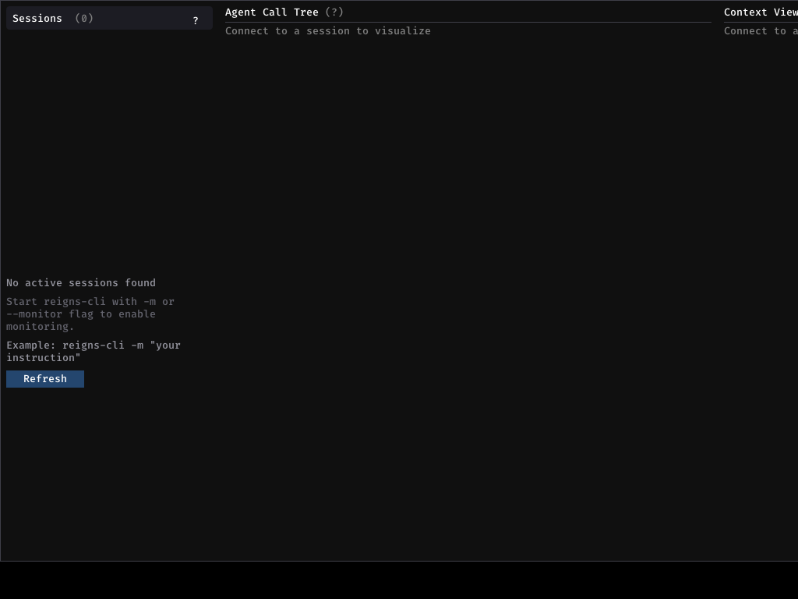

# Test Scenario 02: Window Capture Security Policy

**Feature**: Window capture blacklist/whitelist security policy
**Priority**: High
**Status**: Pending
**Category**: Security/Privacy

---

## Overview

oh_snap implements a comprehensive security policy system to prevent accidental capture of sensitive windows (password managers, banking apps, etc.). This test validates blacklist enforcement, whitelist behavior, and policy configuration.

---

## User Stories

### Perspective A: OpenCode User Prompting an Agent

> **Story 2.1**: "As a security-conscious user, I want my password manager (KeePassXC) to never be captured by the agent, so my passwords remain private."

> **Story 2.2**: "As a developer in a shared workspace, I want certain windows blurred in fullscreen captures, so sensitive information isn't exposed to onlookers."

> **Story 2.3**: "As a team lead, I want to configure which windows can be captured via a whitelist, so team members don't accidentally share sensitive project information."

### Perspective B: Agent Parsing NL Query and Using Tools

> **Story 2.4**: "As an agent, I need to check policy before capturing any window, so I don't expose sensitive information in screenshots."

> **Story 2.5**: "As an agent, I need to handle policy violations gracefully, so I can inform the user why a capture was blocked."

> **Story 2.6**: "As an agent, I need to apply blur to sensitive regions in fullscreen captures, so privacy is maintained even when sensitive windows are visible."

---

## Test Cases

### TC-02.1: Default Blacklist Enforcement

**Preconditions**: 
- Default policy loaded (blacklist enabled)
- KeePassXC window visible on screen

**Steps**:
1. Call `list_windows()` to find KeePassXC window
2. Attempt `capture_window(window_class="KeePassXC")`

**Expected Result**:
- Capture is BLOCKED
- Error message: "Window capture blocked: matches blacklist pattern 'KeePassXC'"
- Audit log entry created

---

### TC-02.2: Glob Pattern Blacklist Matching

**Preconditions**: 
- Blacklist contains `*password*` pattern
- Window named "My Password Vault" visible

**Steps**:
1. Attempt capture of window with name matching `*password*`

**Expected Result**:
- Capture BLOCKED
- Pattern `*password*` matches "My Password Vault"

---

### TC-02.3: Whitelist Mode (Restrictive)

**Preconditions**:
- Policy configured with `whitelist.enabled: true`
- Whitelist patterns: `["Firefox", "Code"]`

**Steps**:
1. Attempt `capture_window(window_class="some-other-app")`

**Expected Result**:
- Capture BLOCKED
- Error: "Window not in whitelist. Allowed: Firefox, Code"

---

### TC-02.4: Blacklist Priority Over Whitelist

**Preconditions**:
- Both blacklist and whitelist enabled
- Pattern `*password*` in blacklist
- Pattern `*password*` in whitelist (edge case)

**Steps**:
1. Attempt capture of password-related window

**Expected Result**:
- Blacklist takes priority
- Capture is BLOCKED

---

### TC-02.5: Fullscreen Blur Policy

**Preconditions**:
- `fullscreen_policy.mode: "blur"`
- `fullscreen_policy.blur_strength: "heavy"`
- Sensitive window (KeePassXC) visible on screen

**Steps**:
1. Call `capture_screen()`

**Expected Result**:
- Full screen captured
- Sensitive window region is BLURRED
- Audit log shows `blur_applied` action

---

### TC-02.6: Fullscreen Reject Policy

**Preconditions**:
- `fullscreen_policy.mode: "reject"`
- Sensitive window visible on screen

**Steps**:
1. Call `capture_screen()`

**Expected Result**:
- Capture REJECTED
- Error lists sensitive windows detected
- User advised to close sensitive windows or change policy

---

### TC-02.7: Off-Screen Window Capture Policy

**Preconditions**:
- Window positioned at negative coordinates (partially off-screen)
- `offscreen_capture.allow: false` (default)

**Steps**:
1. Attempt `capture_window()` for off-screen window

**Expected Result**:
- Capture BLOCKED
- Error: "Window at (-100, 50) is off-screen and cannot be captured"

---

## Policy Configuration File

**Location**: `~/.config/opencode/window-capture-policy.json`

```json
{
  "version": "1.0",
  "offscreen_capture": { "allow": false },
  "whitelist": {
    "enabled": false,
    "patterns": []
  },
  "blacklist": {
    "enabled": true,
    "patterns": [
      "KeePassXC",
      "KeePass",
      "Bitwarden",
      "1Password",
      "*password*",
      "*secret*",
      "*vault*",
      "*credential*"
    ],
    "priority": true
  },
  "fullscreen_policy": {
    "mode": "blur",
    "blur_strength": "heavy"
  },
  "audit": {
    "log_captures": true
  }
}
```

---

## E2E Test Commands

```bash
# Test 1: List windows to find available targets
opencode --mcp-tool oh_snap list_windows '{}'

# Test 2: Attempt to capture blacklisted window (should fail)
opencode --mcp-tool oh_snap capture_window '{"window_class": "KeePassXC"}'

# Test 3: Capture allowed window (should succeed)
opencode --mcp-tool oh_snap capture_window '{"window_class": "firefox"}'

# Test 4: Full screen capture (should blur sensitive windows)
opencode --mcp-tool oh_snap capture_screen '{}'

# Test 5: Check audit log
cat ~/.local/share/oh_snap/capture-audit.log | tail -5
```

---

## Test Evidence

### Screenshot 1: Blocked Capture Error


### Screenshot 2: Blurred Sensitive Region


### Screenshot 3: Audit Log Entry


---

## Success Criteria

- [ ] Blacklist patterns block matching windows
- [ ] Glob patterns (`*`, `?`) work correctly
- [ ] Whitelist mode restricts to allowed windows only
- [ ] Blacklist takes priority over whitelist
- [ ] Fullscreen blur mode works
- [ ] Fullscreen reject mode works
- [ ] Off-screen window capture blocked by default
- [ ] Audit log captures all policy events
- [ ] Policy file permissions are enforced (chmod 600)

---

## Security Considerations

1. **Policy file permissions** must be 600 (owner read/write only)
2. **Pattern validation** rejects regex characters to prevent DoS
3. **Audit logging** provides transparency for compliance
4. **Default deny** for sensitive patterns ensures safety out-of-box